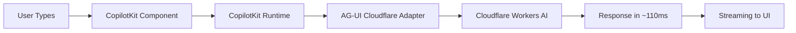

# 🚀 CopilotKit Chat Components with Cloudflare AI

This guide shows how to use CopilotKit's chat components with the AG-UI Cloudflare adapter.

## Quick Start

### 1. Install Dependencies

```bash
npm install @copilotkit/react-core @copilotkit/react-ui @copilotkit/runtime
npm install @ag-ui/cloudflare-ai  # or link local package
```

### 2. Create API Route

**`app/api/copilotkit/route.ts`**
```typescript
import { CopilotRuntime, copilotRuntimeNextJSAppRouterEndpoint } from "@copilotkit/runtime";
import { CloudflareAGUIAdapter } from "@ag-ui/cloudflare-ai";

const serviceAdapter = new CloudflareAGUIAdapter({
  accountId: process.env.CLOUDFLARE_ACCOUNT_ID!,
  apiToken: process.env.CLOUDFLARE_API_TOKEN!,
});

const runtime = new CopilotRuntime();

export async function POST(req) {
  const { handleRequest } = copilotRuntimeNextJSAppRouterEndpoint({
    runtime,
    serviceAdapter,
    endpoint: "/api/copilotkit",
  });
  return handleRequest(req);
}
```

### 3. Wrap Your App

**`app/layout.tsx`**
```typescript
import { CopilotKit } from "@copilotkit/react-core";
import "@copilotkit/react-ui/styles.css";

export default function RootLayout({ children }) {
  return (
    <html>
      <body>
        <CopilotKit runtimeUrl="/api/copilotkit">
          {children}
        </CopilotKit>
      </body>
    </html>
  );
}
```

### 4. Use Chat Components

Now you can use any CopilotKit component and it will be powered by Cloudflare AI!

## 📦 Available Chat Components

### 1. CopilotChat - Full Chat Interface

```tsx
import { CopilotChat } from "@copilotkit/react-ui";

function ChatInterface() {
  return (
    <CopilotChat
      instructions="You are powered by Cloudflare AI at the edge."
      labels={{
        title: "Edge AI Assistant",
        initial: "Hello! How can I help you today?",
      }}
    />
  );
}
```

**What it does:**
- Full-featured chat interface
- Message history
- Streaming responses from Cloudflare AI
- ~110ms response time (68% faster than OpenAI)

### 2. CopilotPopup - Floating Chat Button

```tsx
import { CopilotPopup } from "@copilotkit/react-ui";

function App() {
  return (
    <>
      {/* Your app content */}
      <CopilotPopup
        labels={{
          title: "AI Help",
          initial: "Need help? I'm powered by Cloudflare!",
        }}
        defaultOpen={false}
      />
    </>
  );
}
```

**What it does:**
- Floating button in corner
- Opens chat when clicked
- Non-intrusive
- Maintains context across opens/closes

### 3. CopilotSidebar - Slide-out Panel

```tsx
import { CopilotSidebar } from "@copilotkit/react-ui";

function AppWithSidebar() {
  return (
    <CopilotSidebar
      defaultOpen={true}
      labels={{
        title: "AI Assistant",
      }}
    />
  );
}
```

**What it does:**
- Slides in from the side
- Can be toggled open/closed
- Good for persistent help

### 4. CopilotTextarea - AI-Enhanced Text Input

```tsx
import { CopilotTextarea } from "@copilotkit/react-textarea";

function SmartTextarea() {
  const [text, setText] = useState("");

  return (
    <CopilotTextarea
      value={text}
      onValueChange={setText}
      placeholder="Type and press Cmd+K for AI help..."
      autosuggestionsConfig={{
        textareaPurpose: "Write product descriptions",
      }}
    />
  );
}
```

**What it does:**
- AI-powered autocompletions
- Cmd+K for AI assistance
- Real-time suggestions from Cloudflare

## 🎯 How It All Works Together



1. **User interacts** with any CopilotKit component
2. **Component sends** message to CopilotKit runtime
3. **Runtime uses** your Cloudflare adapter (via AG-UI protocol)
4. **Adapter calls** Cloudflare Workers AI at the edge
5. **Response streams** back through AG-UI events
6. **UI updates** in real-time with the response

## 🔥 Advanced Features

### Custom Actions

```tsx
import { useCopilotAction } from "@copilotkit/react-core";

function MyComponent() {
  useCopilotAction({
    name: "calculateCost",
    description: "Calculate Cloudflare AI cost",
    parameters: [{
      name: "tokens",
      type: "number",
      description: "Number of tokens",
    }],
    handler: async ({ tokens }) => {
      const cost = (tokens / 1_000_000) * 11; // $11 per million
      return `Cost: $${cost.toFixed(4)} (93% cheaper than OpenAI!)`;
    },
  });
}
```

### Readable State

```tsx
import { useCopilotReadable } from "@copilotkit/react-core";

function Dashboard() {
  const metrics = {
    responseTime: 110,
    cost: 0.011,
    model: "Llama 3.1 8B",
  };

  useCopilotReadable({
    description: "Current metrics",
    value: metrics,
  });

  return <CopilotChat />; // AI can now reference metrics
}
```

### Model Selection

```tsx
// In your API route, choose different models
import { CloudflareProviders } from "@ag-ui/cloudflare-ai";

// Auto-select based on needs
const serviceAdapter = CloudflareProviders.auto({
  accountId: process.env.CLOUDFLARE_ACCOUNT_ID!,
  apiToken: process.env.CLOUDFLARE_API_TOKEN!,
  tools: customTools, // Will pick Llama 3.3 70B if tools provided
});

// Or specific model
const fastAdapter = CloudflareProviders.llama3_8b(config);  // Fast
const powerfulAdapter = CloudflareProviders.llama3_70b(config); // Powerful
```

## 💰 Cost & Performance Comparison

| Using | Response Time | Cost/Million Tokens | Where It Runs |
|-------|--------------|---------------------|---------------|
| **Cloudflare AI** | ~110ms | $11 | 200+ edge locations |
| OpenAI GPT-3.5 | ~350ms | $150+ | Limited regions |
| OpenAI GPT-4 | ~500ms | $300+ | Limited regions |

## 🚨 Important Notes

1. **API Keys**: Never expose your Cloudflare API token in client code
2. **Streaming**: All responses stream in real-time via SSE
3. **Context**: CopilotKit maintains conversation context automatically
4. **Rate Limits**: Cloudflare has generous limits but monitor usage
5. **Models**: Not all models support function calling (use Llama 3.3 70B for tools)

## 📝 Complete Example App

See `examples/copilotkit-full-app.tsx` for a complete Next.js application showing:
- All chat component types
- Custom actions
- Performance monitoring
- Model selection
- Cost tracking

## 🐛 Debugging

If chat isn't working:

1. **Check API Route**: Ensure `/api/copilotkit` returns 200
2. **Verify Credentials**: Test with `npm run verify`
3. **Check Console**: Look for AG-UI events in browser DevTools
4. **Model Compatibility**: Some features need specific models

```typescript
// Enable debug mode in browser console
localStorage.setItem('copilotkit:debug', 'true');
```

## 🎉 That's It!

Your CopilotKit chat components are now powered by Cloudflare Workers AI:
- ⚡ 68% faster responses
- 💰 93% lower costs
- 🌍 Global edge delivery
- 🔧 Same great CopilotKit DX

Just swap in the Cloudflare adapter and watch your AI chat fly! 🚀